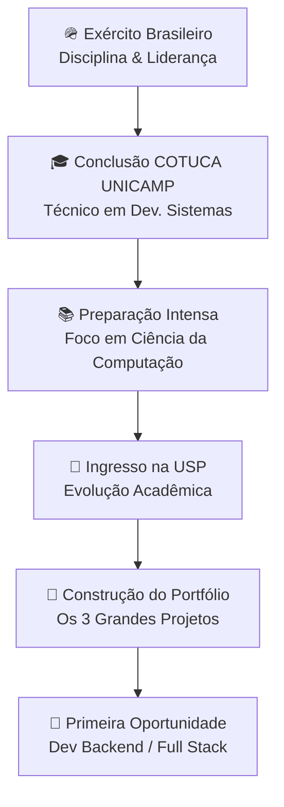

<div align="center">


<div align="center">
  
  
  
</div>


</div>

---

## 🧑‍💻 Sobre Mim

```typescript
const desenvolvedor = {
  nome: "Moisés Filipe Telis de Lima",
  localizacao: "Campinas, SP - Brasil 🇧🇷",
  status_atual: "Servindo ao Exército Brasileiro 🪖",
  educacao: "Colégio Técnico de Campinas - UNICAMP (COTUCA)",
  meta_academica: "Ciência da Computação na USP 🎯",
  
  linguagens: ["Java", "JavaScript", "TypeScript", "Python", "SQL"],
  frameworks: ["Spring Boot", "Node.js", "React", "Next.js"],
  ferramentas: ["Git", "Docker", "PostgreSQL", "MySQL"],
  
  foco: "Arquitetura Backend & APIs Robustas",
  motivacao: "Manter a mente afiada na teoria para transformar código em impacto! 🚀"
};

console.log(`${desenvolvedor.nome}: Disciplina militar aplicada ao desenvolvimento.`);
```

---

## 🛠️ Stack Tecnológico

<div align="center">

### **🚀 Tecnologias que uso**


### **⚙️ Ferramentas & Infraestrutura**


</div>

<br>

<div align="center">
<table>
<tr>
<td align="center" width="50%">

### 💻 **Linguagens**


</td>
<td align="center" width="50%">

### 🎯 **Frameworks**


</td>
</tr>
<tr>
<td align="center">

### 🗄️ **Bancos de Dados**


</td>
<td align="center">

### ☁️ **Nuvem e DevOps**


</td>
</tr>
</table>
</div>

---

## 🏗️ Backlog de Projetos (A Serem Construídos 🚀)

Atualmente, devido à rotina intensa no Exército Brasileiro, meu foco está na absorção teórica, arquitetura de software e algoritmos. Abaixo está o meu roadmap de projetos estratégicos que irei desenvolver para consolidar minha transição para o mercado:

### 1. 💳 **FinTech API - Sistema Bancário Seguro**

**O que é:** Uma API RESTful robusta simulando um sistema bancário digital.

**Stack Planejada:** Java, Spring Boot, Spring Security (JWT), PostgreSQL e JUnit.

**O que chama atenção:** Implementação de autenticação segura, controle de transações financeiras com propriedades ACID (evitando double-spending), histórico de transferências e alta cobertura de testes unitários. O queridinho dos recrutadores de backend.

---

### 2. 🛒 **E-Commerce Microservices - Arquitetura Distribuída**

**O que é:** Um ecossistema de e-commerce dividido em pequenos serviços independentes.

**Stack Planejada:** Node.js (TypeScript), NestJS, Docker, Redis e RabbitMQ/Kafka.

**O que chama atenção:** Demonstra conhecimento avançado em microsserviços, mensageria assíncrona para comunicação entre serviços (ex: serviço de pedido avisa o serviço de estoque) e cache para performance.

---

### 3. 📊 **SaaS Plataforma de Gestão Full Stack**

**O que é:** Um painel/dashboard interativo para gerenciamento de projetos ou equipes em tempo real.

**Stack Planejada:** Next.js (React), TailwindCSS, Prisma ORM, Node.js e WebSockets.

**O que chama atenção:** Domínio de Server-Side Rendering (SSR) com Next.js, componentização limpa no Front, banco de dados relacional e comunicação em tempo real (WebSockets) para atualizações instantâneas na tela.

---

## 🌱 Linha de Aprendizado & Carreira



---

## ✅ Objetivos 2026

- [ ] Concluir o ano de instrução militar com excelência e resiliência
- [ ] Avançar na grade curricular do COTUCA mantendo alto desempenho
- [ ] Manter rotina de estudos teóricos focada no vestibular de Ciência da Computação (USP)
- [ ] Desenhar e documentar a arquitetura dos 3 projetos do backlog
- [ ] Iniciar desenvolvimento do primeiro projeto (FinTech API)
- [ ] Consolidar base teórica em Estruturas de Dados e Algoritmos

---

## 📈 Estatísticas GitHub

<div align="center">

<table>
<tr>
<td>
  
</td>
<td>
  
</td>
</tr>
</table>

</div>

---

## 📬 Vamos Conectar!

<div align="center">

### 🤝 **Sempre aberto para:**

Networking • Dicas de Estudo • Mentoria • Futuras Oportunidades • Projetos Colaborativos

<table>
<tr>
<td align="center">
  <a href="https://www.linkedin.com/in/moisés-filipe-568412297/">
    
  </a>
</td>
<td align="center">
  <a href="mailto:moiseisfelipi@gmail.com">
    
  </a>
</td>
</tr>
<tr>
<td align="center">
  <a href="https://wa.me/5519971154452">
    
  </a>
</td>
<td align="center">
  <a href="https://www.instagram.com/dupe_mosh/">
    
  </a>
</td>
</tr>
</table>

---

<!-- Footer animado -->


**💫 Transformando curiosidade em código, um commit por vez!**


</div>