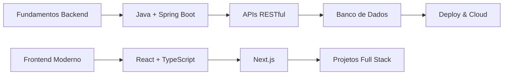

<div align="center">

<!-- Cabeçalho Animado Principal -->


<!-- Animação de Digitação -->


<!-- Badges de Perfil -->
<p align="center">
  
  
  
  
</p>

</div>

---

## 🧑‍💻 Sobre Mim

<div align="center">

```typescript
const desenvolvedor = {
  nome: "Moisés Filipe Telis de Lima",
  apelido: "omoshaa",
  localização: "Campinas, SP - Brasil 🇧🇷",
  educação: "Colégio Técnico de Campinas - UNICAMP",
  curso: "Desenvolvimento de Sistemas",
  nível: "Jovem Padawan em Formação 🌱",

  linguagens: ["Java", "JavaScript", "TypeScript", "Python", "SQL"],
  frameworks: ["Spring Boot", "Node.js", "React", "Next.js"],
  bancosDados: ["PostgreSQL", "MySQL", "Oracle", "MongoDB"],
  ferramentas: ["Git", "Docker", "VS Code", "IntelliJ IDEA"],
  cloud: ["Google Cloud Platform", "AWS (básico)"],

  foco: "Backend Development & Full Stack",
  objetivo: "Primeira oportunidade profissional como dev",
  motivação: "Transformar curiosidade em código! 🚀",
};

console.log(`${desenvolvedor.nome} está ${desenvolvedor.motivação}`);
```

</div>

<div align="center">

### 🎯 **Missão Atual**

_"Dominando os fundamentos do desenvolvimento full stack enquanto construo uma base sólida em programação e boas práticas de código!"_

</div>

---

## 🛠️ Stack Tecnológico

<div align="center">

### **Linguagens & Frameworks**


### **Ferramentas & Infraestrutura**


</div>

<table align="center">
<tr>
<td align="center" width="33%">

### 🔥 **Backend**


</td>
<td align="center" width="33%">

### 🎨 **Frontend**


</td>
<td align="center" width="33%">

### 📊 **Dados & Cloud**


</td>
</tr>
</table>

---

## 📈 Estatísticas GitHub

<div align="center">


</div>

---

## 🏆 Conquistas & Troféus

<div align="center">
  


</div>

---

## 🚀 Projetos em Destaque

<div align="center">

### 📂 **Meus Repositórios de Estudo**

<table>
<tr>
<td width="50%">

**🌱 Projetos de Aprendizado**

- 📚 Exercícios e estudos práticos
- 🏗️ Projetos acadêmicos do curso
- 🧪 Experimentos com novas tecnologias
- 📖 Implementações de tutoriais

</td>
<td width="50%">

**🎯 Focos Atuais**

- ☕ Dominando Java & Spring Boot
- 🌐 APIs RESTful e microserviços
- 🗄️ Modelagem e consultas SQL
- 🔧 Práticas de Clean Code

</td>
</tr>
</table>

<a href="https://github.com/omoshaa?tab=repositories">
  
</a>

</div>

---

## 📚 Jornada de Aprendizado

<div align="center">

### 🎓 **Atualmente Estudando**



</div>

<table align="center">
<tr>
<td align="center" width="50%">

### 🎯 **Objetivos 2025**

- ✅ Concluir curso técnico com excelência
- 🎯 Dominar stack Java + Spring Boot
- 🚀 Construir 5+ projetos completos
- 💼 Conseguir primeira oportunidade como dev
- 🌟 Contribuir para projetos open source

</td>
<td align="center" width="50%">

### 🌱 **Próximos Passos**

- 📖 Aprofundar em arquitetura de software
- ☁️ Expandir conhecimentos em cloud
- 🧪 Explorar testes automatizados
- 📱 Iniciar estudos em mobile
- 🤝 Participar de comunidades tech

</td>
</tr>
</table>

---

## 📊 Atividade de Desenvolvimento

<div align="center">


</div>

---

## 🌟 Destaques & Conquistas

<div align="center">

<table>
<tr>
<td align="center">
  
  <br><sub>Consistência nos estudos</sub>
</td>
<td align="center">
  
  <br><sub>Sempre buscando novos conhecimentos</sub>
</td>
<td align="center">
  
  <br><sub>Adorando resolver desafios</sub>
</td>
</tr>
</table>

### 💫 **Fun Facts**

```
🌱 Apaixonado por código limpo e boas práticas
☕ Movido a café e muita curiosidade
🎯 Cada erro é uma oportunidade de aprender
📚 Leio documentação como aventura
🎮 Gamer - RPGs me ensinaram persistência
💡 Amo transformar ideias em soluções
```

</div>

---

## 📬 Vamos Conectar!

<div align="center">

### 🤝 **Sempre aberto para conversar sobre:**

_Programação • Oportunidades • Projetos colaborativos • Dicas de estudo_

<table>
<tr>
<td align="center">
  <a href="https://www.linkedin.com/in/moisés-filipe-telis-de-lima-568412297/">
    
  </a>
</td>
<td align="center">
  <a href="mailto:moiseisfelipi@gmail.com">
    
  </a>
</td>
<td align="center">
  <a href="https://www.instagram.com/dupe_mosh/">
    
  </a>
</td>
<td align="center">
  <a href="https://discord.com/users/665952515790995468">
    
  </a>
</td>
</tr>
</table>

### 🎯 **Procurando por:**

Mentoria • Projetos colaborativos • Estágios • Primeira oportunidade profissional

---


**💫 Sempre aprendendo, sempre crescendo, sempre codando!**

</div>
