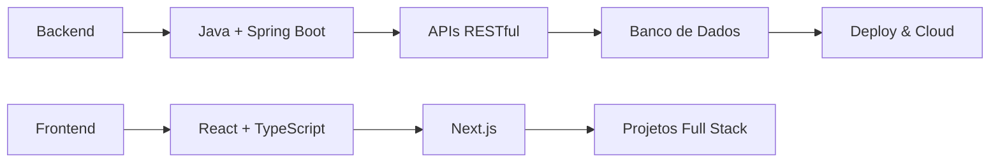

<div align="center">

# 👋 Olá, eu sou Moisés Filipe

🌱 Estudante de Desenvolvimento de Sistemas | 🚀 Transformando ideias em código | 💡 Sempre aprendendo

[]()
[]()
[]()

</div>

---

## 🧑‍💻 Sobre Mim

```typescript
const desenvolvedor = {
  nome: "Moisés Filipe Telis de Lima",
  localização: "Campinas, SP - Brasil 🇧🇷",
  educação: "Colégio Técnico de Campinas - UNICAMP",
  curso: "Desenvolvimento de Sistemas",
  nível: "Jovem Padawan 🌱",

  linguagens: ["Java", "JavaScript", "TypeScript", "Python", "SQL"],
  frameworks: ["Spring Boot", "Node.js", "React", "Next.js"],
  ferramentas: ["Git", "Docker", "VS Code", "IntelliJ IDEA"],
  cloud: ["GCP", "AWS (básico)"],

  foco: "Backend & Full Stack",
  objetivo: "Primeira oportunidade profissional",
  motivação: "Transformar curiosidade em código! 🚀",
};

console.log(`${desenvolvedor.nome} está ${desenvolvedor.motivação}`);
```

---

## 🛠️ Stack Tecnológico

**Linguagens & Frameworks:**


**Ferramentas & Infra:**


---

## � Projetos & Estudos

**Projetos de Aprendizado:**

- 📚 Exercícios práticos e tutoriais
- 🏗️ Projetos acadêmicos
- 🧪 Experimentos com novas tecnologias

**Focos Atuais:**

- ☕ Backend com Java & Spring Boot
- 🌐 APIs RESTful e microserviços
- 🗄️ Banco de dados e modelagem SQL
- 🔧 Clean Code & boas práticas

[Ver todos os repositórios](https://github.com/omoshaa?tab=repositories)

---

## 📈 GitHub

<div align="center">


</div>

---

## 🌱 Aprendizado & Objetivos



**Objetivos 2025:**

- ✅ Concluir curso técnico com excelência
- 🎯 Dominar Java + Spring Boot
- 🚀 Construir 5+ projetos completos
- 💼 Conseguir primeira oportunidade como dev
- 🌟 Contribuir em projetos open source

---

## 📬 Contato

[](https://www.linkedin.com/in/moisés-filipe-telis-de-lima-568412297/)
[](mailto:moiseisfelipi@gmail.com)
[](https://www.instagram.com/dupe_mosh/)
[](https://discord.com/users/665952515790995468)

> **Transformando curiosidade em código, um commit por vez!** 🚀
