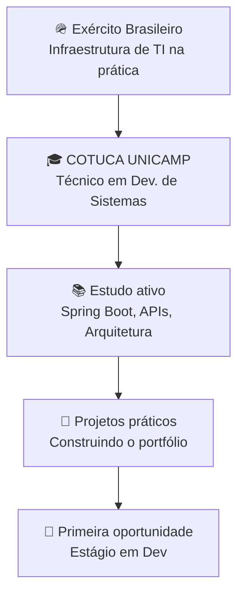

## 🧑‍💻 Sobre Mim

```js
const desenvolvedor = {
  nome: "Moisés Filipe Telis de Lima",
  localizacao: "Campinas, SP - Brasil 🇧🇷",
  status_atual: "Servindo ao Exército Brasileiro 🪖 (TI / Infraestrutura)",
  educacao: "Colégio Técnico de Campinas - UNICAMP (COTUCA) | Dev. de Sistemas",
  meta_academica: "Ciência da Computação 🎯",

  stack_atual: ["Java", "Python", "C#", ".NET", "JavaScript", "HTML", "CSS"],
  ferramentas: ["Git/GitHub", "Docker", "MySQL", "Flutter", "Esp32"],

  em_estudo: ["Spring Boot", "Node.js", "React", "Arquitetura de APIs"],

  foco: "Construir uma base sólida antes de empilhar frameworks",
  motivacao: "Curiosidade que virou rotina de aprender todo dia 🚀"
};

console.log(`${desenvolvedor.nome}: aprendendo na prática, um commit por vez.`);
```

---

## 🛠️ Stack Tecnológico

### ✅ O que eu já uso e pratico


- 💻 **Linguagens:** Java · Python · C# · JavaScript
- ⚙️ **Plataformas/Frameworks:** .NET Framework · Flutter
- 🗄️ **Banco de Dados:** MySQL
- 🔧 **Ferramentas:** Git/GitHub · Docker · Esp32 (eletrônica/IoT)
- 🪖 **Infraestrutura na prática:** manutenção de hardware, redes, VPN, servidores e gestão de dados (experiência atual no Exército Brasileiro)

### 🎯 Em estudo agora (ainda não é entrega, é aprendizado ativo)


Estou estudando Spring Boot, Node.js, React e fundamentos de arquitetura de APIs para meus próximos projetos práticos. Documento esse processo aqui no GitHub conforme avanço — sem pressa de parecer mais avançado do que estou, só consistência.

---

## 🏗️ Projetos

### Em andamento / concluídos

### 🔭 Próximos passos planejados

Estou desenhando os próximos projetos para aplicar o que estudo hoje. Quando saírem do papel, viram entrada aqui em cima — não antes.

1. **API REST simples com Spring Boot** — autenticação básica + CRUD, para consolidar backend com Java.
2. **Dashboard com React** — interface simples consumindo uma API própria.
3. **Automação em Python** — script prático de uso real (não apenas exercício de curso).

---

## 🌱 Linha de Aprendizado & Carreira



---

## ✅ Objetivos 2026

- [ ] Concluir o ano de instrução militar com excelência
- [ ] Avançar na grade curricular do COTUCA mantendo bom desempenho
- [ ] Construir e publicar meu primeiro projeto prático com Spring Boot
- [ ] Consolidar fundamentos de estruturas de dados e algoritmos
- [ ] Conquistar minha primeira oportunidade de estágio em desenvolvimento

---

## 📬 Vamos Conectar!

Sempre aberto para: networking · dicas de estudo · mentoria · oportunidades de estágio

- [LinkedIn](https://www.linkedin.com/in/mois%C3%A9s-filipe-telis-de-lima-568412297/)
- [Email](mailto:moiseisfelipi@gmail.com)

---

💫 **Aprendendo na prática, sem pular etapas.**
